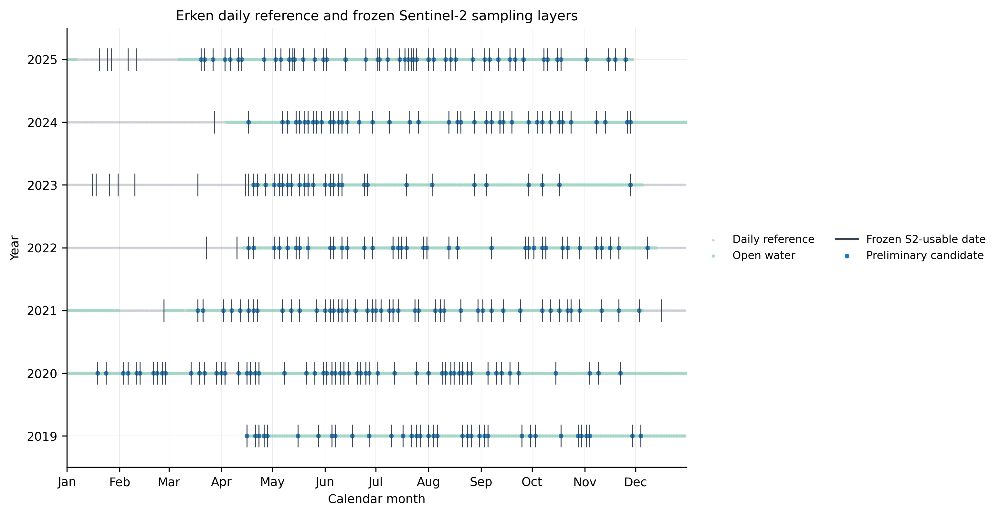
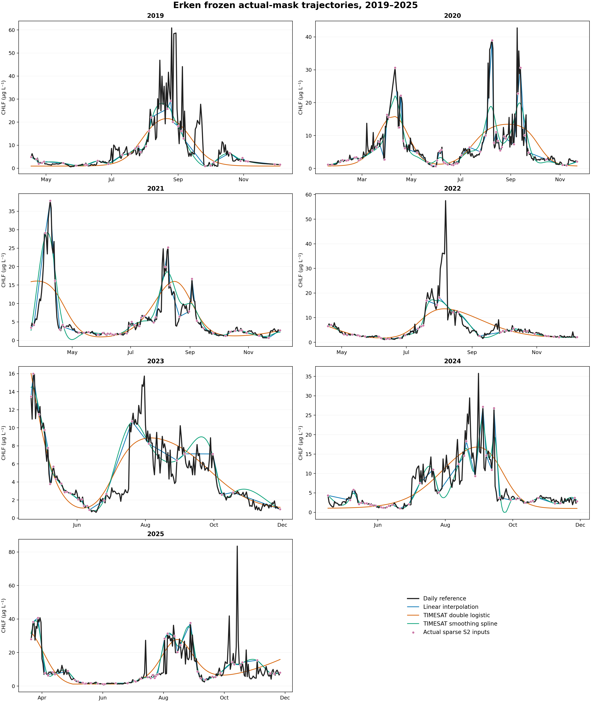
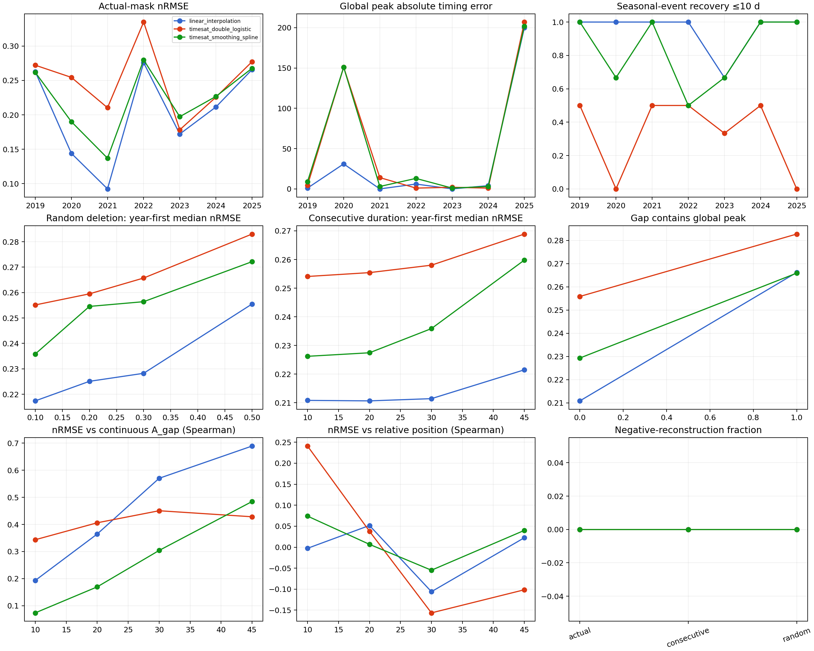
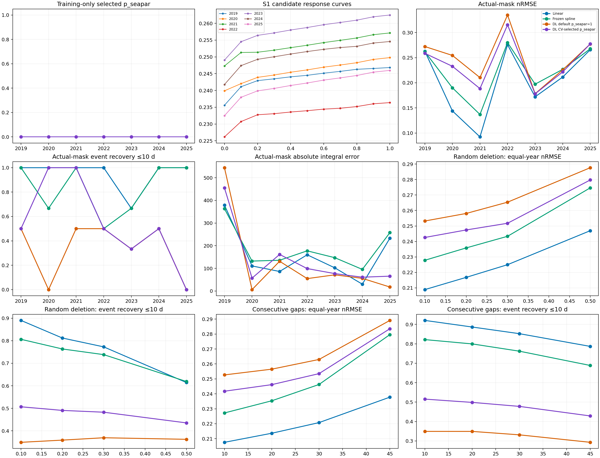
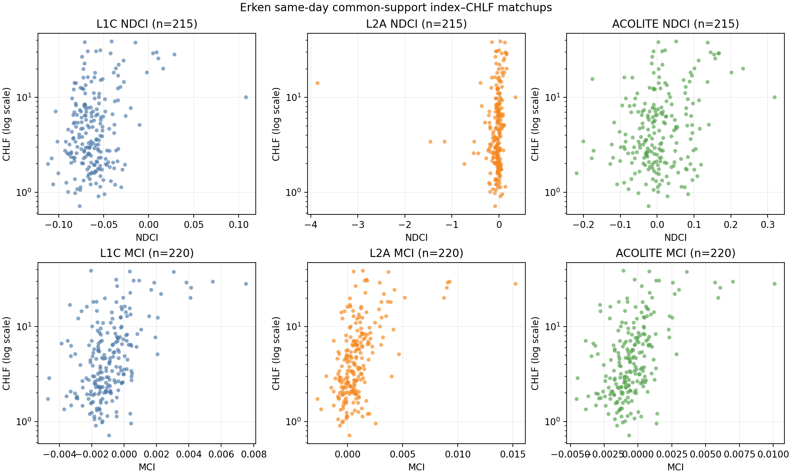

# Reliability limits of reconstructing lake chlorophyll phenology from incomplete Sentinel-2 sampling

Running title: Lake chlorophyll temporal reconstruction

## Abstract

Optical satellite records of inland-water chlorophyll are interrupted by cloud, ice and failed aquatic-pixel quality control. Smooth daily trajectories are often produced from the remaining observations, but the seasonal information that survives reconstruction is rarely tested against a dense independent reference. We used a continuous daily chlorophyll-fluorescence record from Lake Erken, Sweden, from 17 April 2019 to 30 November 2025 to evaluate temporal reconstruction under the dates that were actually usable in the local Sentinel-2 archive. A scene-classification rule, frozen without inspecting chlorophyll, retained 307 of 926 acquisition dates; intersecting these dates with open water and finite reference measurements yielded 288 sparse inputs across seven lake-years. Linear interpolation, TIMESAT double logistic with frozen defaults, and a TIMESAT smoothing spline selected by nested leave-one-year-out validation were evaluated only on daily reference dates withheld from each reconstruction. Controlled experiments added 2,800 random-deletion masks and 5,746 exhaustive internal gap windows. A supplementary frozen protocol evaluated 18 major seasonal events. Linear interpolation had the lowest equal-year mean normalized root-mean-square error under the actual mask (0.203), followed by the smoothing spline (0.223) and default double logistic (0.250). Linear interpolation recovered 17 of 18 events within 10 days, the spline recovered 15, and default double logistic recovered 5. All methods completed every controlled-gap scenario, but normalized error rose and event recovery fell with additional deletion and longer gaps. Training-only selection of the double-logistic seasonal parameter improved its event recovery to 9 of 18 and reduced mean normalized error to 0.239, while increasing absolute integral error in six of seven years. In a separate exact-date analysis of real Sentinel-2 reflectance products, the Maximum Chlorophyll Index carried more consistent same-day information about the reference than the Normalized Difference Chlorophyll Index across L1C, official L2A and ACOLITE products, although no processor was uniquely superior. These results show that a smooth trajectory is not sufficient evidence of seasonal reliability. In this single-lake benchmark, simple interpolation retained event identity better than more strongly constrained seasonal fits, while gap duration, hidden within-gap activity and the target metric jointly determined reconstruction error.

Keywords: chlorophyll fluorescence; inland waters; Sentinel-2; TIMESAT; temporal interpolation; phytoplankton phenology; cloud gaps; MCI; NDCI

## Introduction

Satellite observations can extend inland-water monitoring beyond the spatial and temporal coverage of conventional sampling, but lake colour remains difficult to measure consistently. Inland waters are optically complex, often small relative to land-oriented pixels, and affected by atmospheric correction, land adjacency, changing mixtures of phytoplankton, suspended particles and coloured dissolved organic matter (Palmer et al., 2015a; Tyler et al., 2016). Sentinel-2 adds red and red-edge bands at spatial resolutions useful for many lakes and a nominal multi-satellite revisit interval of several days (Drusch et al., 2012). The usable temporal record is nevertheless much sparser than the acquisition calendar because clouds, shadows, cirrus, snow, ice and locally invalid water pixels remove observations.

Incomplete sampling matters because phytoplankton blooms are events, not only distributions of concentration. Peak timing, event identity and cumulative seasonal exposure can respond differently to the same reconstruction. A curve can have a small average error while missing a short bloom, or reproduce a seasonal integral while shifting the dominant peak to another event. Previous work has demonstrated that TIMESAT and related smoothers can retrieve phytoplankton phenology from satellite time series (Palmer et al., 2015b; Maeda et al., 2019). The reliability of those metrics, however, depends on the temporal mask, the dynamics hidden inside each gap and the shape constraints imposed by the reconstruction method.

Evaluation is especially difficult when satellite retrieval error and temporal reconstruction error are mixed. A sparse satellite-derived chlorophyll series differs from an in situ record because of radiometry, atmospheric correction, horizontal and vertical sampling, bio-optical conversion and timing. If reconstruction is evaluated only against occasional field samples, these sources of error cannot be separated. Lake Erken provides a complementary benchmark: a daily chlorophyll-fluorescence reference can be sampled on real Sentinel-2 usable dates and the resulting reconstruction can be compared with the withheld daily reference. This design estimates the information loss caused by the actual observation calendar and the temporal method, conditional on perfect chlorophyll values at the retained dates. It is therefore an upper-bound temporal experiment rather than a claim that daily fluorescence is equivalent to satellite surface chlorophyll.

We asked four questions. First, how much of the daily open-water reference remains after a reproducible Sentinel-2 quality mask is applied? Second, how do linear interpolation, TIMESAT double logistic and TIMESAT smoothing spline differ in point-wise error, peak timing, seasonal-event recovery, integral error and trajectory agreement? Third, how do random observation loss and consecutive internal gaps alter these outcomes? Fourth, do quality-controlled real Sentinel-2 red-edge indices contain same-day information about the Erken reference across top-of-atmosphere, official surface-reflectance and aquatic atmospheric-correction products? The reconstruction contract, event rules, masks, parameter grids and thresholds were frozen before their respective performance outputs were inspected.

## Materials and Methods

### Study site and daily reference

Lake Erken is a monitored Swedish lake with a Sentinel-2 reference coordinate at 59.84029 degrees N and 18.625827 degrees E. The reference dataset was supplied by the Swedish Infrastructure for Ecosystem Science and contains daily chlorophyll fluorescence adjusted using laboratory measurements (Erken Laboratory, 2026). The source spans 17 April 2019 through 30 November 2025 and contains 2,420 unique calendar dates with no missing dates inside that interval, duplicate dates, non-finite values or negative values. CHLF is reported in micrograms per litre. The source flags ice presence; 1,950 dates were classified as open water.

The daily product represents the 00:00 observation from higher-frequency sonde measurements, selected by the provider to reduce non-photochemical-quenching effects. Measurement configurations changed during the record. The 2019-2022 period included a YSI profiler during spring to autumn and a YSI sonde under ice, whereas the 2023-2025 metadata include measurements from the Malma Island pumping system at approximately 3 m depth. We retained the original values and a broad pre-2023 versus 2023-onward provenance label, but did not interpret that label as a causal instrument change. The record begins and ends during open water, so 2019 and 2025 were treated as boundary-truncated years and evaluated only over their observed common support.

### Sentinel-2 observation mask

The local archive contained 950 Level-2A products on 926 unique dates within the reference interval. Scene quality was assessed at the station coordinate from each product's native Scene Classification Layer. We first compared centred 1 by 1, 3 by 3, 5 by 5, 7 by 7 and 11 by 11 pixel windows on the 20 m grid. A 3 by 3 window, representing 60 by 60 m, was frozen as the primary neighbourhood; 1 by 1 and 5 by 5 were retained as spatial sensitivities.

The primary product-level rule was selected without reference to CHLF, spectral-index values or reconstruction results. A product passed when its 3 by 3 window contained at least eight water pixels, no more than one obvious-bad pixel, no persistent non-water or class-2 pixel, and a centre pixel that was not an obvious-bad class. Obvious-bad classes were SCL 0, 1, 3, 8, 9, 10 and 11. A date was usable when at least one same-day product passed. The rule retained 313 products and 307 unique dates. Intersecting date-level usability with open water and finite CHLF produced 288 actual-mask sparse inputs. Every method received the same date-value pairs.

### Common support and reconstruction methods

For each year, common support comprised open-water dates from the first through the last sparse input, with disconnected open-water segments retained separately. Evaluation did not credit extrapolation outside those limits. Point-wise errors used only common-support dates that had not been supplied as sparse inputs.

The primary benchmark contained three methods. Linear interpolation was a fixed deterministic baseline. TIMESAT double logistic used the effective defaults from TIMESAT 4.4.1 through timesat-cli 1.9.2, including the default seasonal parameter `p_seapar=1`; the full effective-default snapshot was frozen before performance execution. TIMESAT smoothing spline used the fixed candidate grid 0, 1, 3, 10, 30, 100, 300 and 1000. For each outer test year, the spline value was selected using only the other six years. Each candidate reconstructed each training year separately, and the six year-level normalized root-mean-square errors were averaged with equal year weight. Exact ties favoured the smaller smoothing value. The selected values for 2019-2025 were 10, 100, 100, 10, 10, 3 and 10, respectively.

### Reconstruction metrics

Point-wise metrics were bias, mean absolute error, root-mean-square error and normalized root-mean-square error. The year-specific normalization scale was the difference between the 95th and 5th percentiles of the daily reference over common support. Thus, `nRMSE = RMSE / (Q95 - Q05)`. Across-year summaries first reduced outcomes to one value per lake-year so that dense daily values were not treated as independent seasonal replicates.

The primary seasonal timing target was the global maximum within common support. Contiguous equal-height plateaus were assigned their temporal midpoint; non-contiguous equal global maxima and reference maxima on a support boundary were explicitly flagged. The primary reliability criterion was an absolute peak-date error of no more than 10 calendar days, with 5- and 15-day sensitivities. We also recorded peak-magnitude error, daily trapezoidal integral error within each contiguous open-water segment and Pearson correlation between reconstructed and reference trajectories. Negative predictions were retained and audited rather than clipped.

### Seasonal-event detection and matching

A supplementary event protocol was frozen after global-maximum results had been inspected and was therefore classified as secondary and exploratory. Reference events were detected independently within each open-water segment using SciPy `find_peaks` with a minimum distance of 30 days, prominence of 0.30 times the yearly Q95-Q05 scale and explicit plateau detection. No smoothing, height threshold or width threshold was applied. The detector identified 18 reference events: two in 2019, three in 2020, two in 2021, two in 2022, three in 2023, two in 2024 and four in 2025.

Reconstructed candidates were detected without minimum height, prominence or separation so that amplitude could not decide event identity. Reference and reconstructed peaks could match only within the same year and open-water segment and within 15 calendar days. One-to-one assignment first maximized the number of matched reference events, then minimized total absolute timing error, with chronological deterministic tie-breaking. A valid reconstruction with no eligible candidate was counted as a missed event and failed the 5-, 10- and 15-day criteria.

### Controlled missingness experiments

Controlled gaps began from each year's frozen actual-mask sparse inputs and protected the first and last inputs. Random deletion removed 10%, 20%, 30% or 50% of interior observations using 100 deterministic replicates for every year and deletion level, giving 2,800 masks and 8,400 method-scenario reconstructions. The master seed was 20260901.

Consecutive-gap experiments exhaustively slid 10-, 20-, 30- and 45-day calendar windows through every eligible contiguous open-water segment. A window was retained when it removed at least one sparse observation and did not remove a support endpoint. This produced 5,746 windows and 17,238 method-scenario reconstructions. Each window retained its duration, number of removed observations, relative position, whether it contained the reference global maximum, and a normalized activity measure. The activity measure summed absolute day-to-day CHLF changes wholly inside the hidden window and divided them by the yearly Q95-Q05 scale. Spline settings were inherited from actual-mask selection and were never retuned by scenario.

### Double-logistic parameter sensitivity

The primary double-logistic benchmark retained the TIMESAT default. A separately frozen secondary sensitivity evaluated `p_seapar` values from 0.0 to 1.0 in increments of 0.1. For each outer test year, candidate selection used only the other six years and the same equal-year nRMSE rule. Event metrics, integral error and controlled-gap results could not influence selection. The selected value was then applied unchanged to the held-out year and to every controlled-gap scenario for that year.

### Real Sentinel-2 index matchup

The reconstruction benchmark used CHLF sampled at Sentinel-2 usable dates and did not depend on a satellite chlorophyll retrieval. We therefore conducted a separate observation-layer analysis using real reflectance products. B4, B5 and B6 were extracted on a common 20 m grid from Level-1C top-of-atmosphere reflectance, official Level-2A bottom-of-atmosphere reflectance and ACOLITE `rhos`. Level-1C and Level-2A digital numbers were converted with their product-specific additive offsets and quantification values; ACOLITE performs the corresponding Level-1C offset and quantification handling internally before producing `rhos` (Vanhellemont and Ruddick, 2018). No additional empirical processing-baseline correction was applied.

Pixel-level NDCI was `(B5 - B4) / (B5 + B4)`, following the red to red-edge formulation of Mishra and Mishra (2012). MCI was B5 minus the wavelength-interpolated B4-to-B6 baseline at 705 nm, using nominal wavelengths 665, 705 and 740 nm (Gower et al., 2005; Salls et al., 2024). An index observation required at least six valid pixels in the frozen 3 by 3 window, and the observation value was the median of valid pixel-level indices. Calendar date was the only CHLF matchup key; nearest-date substitution and temporal interpolation were prohibited.

Primary comparisons used exact L1C-L2A-ACOLITE source alignment, open water, finite same-day CHLF and eligibility for the same index in all three products. Spearman correlation with raw CHLF was primary. Pearson correlation with log10(CHLF) and a one-predictor calendar-year leave-one-year-out model were secondary. Pooled correlation uncertainty used 10,000 whole-year bootstrap resamples. The analysis compared products descriptively and did not select a processor winner or define a transferable absolute chlorophyll retrieval.

### Reproducibility and governance

The reconstruction contract, event protocol, masks, seeds, parameter grids, effective TIMESAT defaults and observation thresholds were stored as versioned human- and machine-readable files before the corresponding performance analyses. Every output manifest records input and output SHA256 values, code revision, runtime versions and worktree state. The complete test suite was run before release; external-runtime tests are skipped unless the frozen TIMESAT interpreter is supplied. Vombsjön data and results were not accessed.

## Results

### Actual Sentinel-2 sampling

Only 307 of 926 acquisition dates passed the frozen SCL date-level rule. Nineteen passing dates occurred outside the open-water domain, leaving 288 reconstruction inputs. Annual input counts ranged from 27 in 2023 to 56 in 2020. The median within-year interval was 3-5 days, but the maximum reached 42 days in 2023. Cross-year winter intervals were longer and were excluded from internal open-water gap interpretation.

| Year | Sparse inputs | First input | Last input | Median within-year interval d | Maximum within-year interval d |
|---:|---:|:---|:---|---:|---:|
| 2019 | 35 | 17 Apr | 5 Dec | 5 | 25 |
| 2020 | 56 | 19 Jan | 22 Nov | 3 | 22 |
| 2021 | 46 | 19 Mar | 4 Dec | 5 | 15 |
| 2022 | 36 | 18 Apr | 9 Dec | 5 | 20 |
| 2023 | 27 | 21 Apr | 29 Nov | 4 | 42 |
| 2024 | 40 | 17 Apr | 28 Nov | 5 | 20 |
| 2025 | 48 | 21 Mar | 26 Nov | 5 | 15 |

### Reconstruction under the actual observation mask

All 21 primary year-method reconstructions completed and produced finite values over required support. None produced negative daily values. Linear interpolation had the smallest equal-year mean nRMSE at 0.203, followed by smoothing spline at 0.223 and default double logistic at 0.250. The same ordering was present in median year-level nRMSE values of 0.211, 0.227 and 0.254. Pearson trajectory agreement was 0.864, 0.830 and 0.742, respectively.

The metrics did not identify a single best representation of all seasonal properties. Default double logistic had the lowest equal-year mean absolute integral error at 126 microgram days per litre, compared with 157 for linear interpolation and 187 for smoothing spline. It nevertheless had the highest point-wise error and recovered fewer events. Linear interpolation reproduced all 18 events within the 15-day matching window and placed 17 within 10 days. Smoothing spline matched and recovered 15 within 10 days. Default double logistic matched eight events and recovered five within 10 days.

| Method | Equal-year mean nRMSE | Equal-year mean Pearson r | Mean absolute integral error | Matched events | Events within 10 d |
|:---|---:|---:|---:|---:|---:|
| Linear interpolation | 0.203 | 0.864 | 157.5 | 18/18 | 17/18 |
| TIMESAT smoothing spline | 0.223 | 0.830 | 187.1 | 15/18 | 15/18 |
| TIMESAT double logistic default | 0.250 | 0.742 | 126.0 | 8/18 | 5/18 |
| TIMESAT double logistic CV sensitivity | 0.239 | 0.776 | 139.5 | 10/18 | 9/18 |

Global-maximum timing was less stable than event matching because a reconstructed curve could select a different seasonal event as the annual maximum. Linear interpolation met the 10-day global-peak threshold in five of seven years; smoothing spline and default double logistic each did so in four. The very large global-peak errors in 2020 and 2025 coexisted with much stronger multi-event recovery, showing that annual-maximum identity and seasonal-event recovery answer different questions.

### Additional missingness

No reconstruction failed in any of the 2,800 random-deletion or 5,746 consecutive-gap scenarios. Error increased with stronger deletion for every method when lake-years were weighted equally. For linear interpolation, mean nRMSE rose from 0.209 at 10% random deletion to 0.247 at 50%, while 10-day event recovery fell from 0.890 to 0.614. Smoothing-spline nRMSE rose from 0.228 to 0.275 and event recovery fell from 0.806 to 0.619. Default double-logistic nRMSE rose from 0.253 to 0.288, but event recovery remained low, from 0.349 to 0.363, because the actual-mask fit already missed many reference events.

Consecutive gaps produced the same broad pattern. Between 10- and 45-day windows, linear-interpolation nRMSE rose from 0.208 to 0.238 and event recovery fell from 0.920 to 0.787. Smoothing-spline nRMSE rose from 0.227 to 0.280 and recovery fell from 0.822 to 0.688. Default double-logistic nRMSE rose from 0.253 to 0.289 and recovery fell from 0.349 to 0.293. These duration summaries conceal strong variation among years and window positions. Within-year associations generally showed larger nRMSE where a gap concealed more reference activity, while relative position alone had smaller and inconsistent associations. Windows containing the global peak also increased global-peak timing errors, but no single duration separated reliable from unreliable reconstruction across metrics and years.

| Gap experiment | Level | Linear nRMSE event recovery | Spline nRMSE event recovery | Default DL nRMSE event recovery | CV DL nRMSE event recovery |
|:---|:---|:---:|:---:|:---:|:---:|
| Random deletion | 10% | 0.209 0.890 | 0.228 0.806 | 0.253 0.349 | 0.243 0.507 |
| Random deletion | 50% | 0.247 0.614 | 0.275 0.619 | 0.288 0.363 | 0.280 0.435 |
| Consecutive gap | 10 d | 0.208 0.920 | 0.227 0.822 | 0.253 0.349 | 0.242 0.515 |
| Consecutive gap | 45 d | 0.238 0.787 | 0.280 0.688 | 0.289 0.293 | 0.284 0.429 |

Values are equal-year means; each cell gives nRMSE followed by the fraction of reference events recovered within 10 days. Artificial masks are nested within seven lake-years and are not independent ecological replicates.

### Double-logistic seasonal-parameter sensitivity

Every outer fold selected `p_seapar=0.0` from the frozen 0.0-1.0 grid. Candidate curves differed on real training data, and mean training nRMSE increased with larger values, so the selection was not an arbitrary numerical tie. Relative to the default, cross-validated double logistic reduced held-out nRMSE in six of seven years and changed the equal-year mean from 0.250 to 0.239. It matched ten events and recovered nine within 10 days, compared with eight matches and five timely recoveries for the default.

The improvement was metric-specific. Absolute integral error increased in six of seven years, and the equal-year mean increased from 126.0 to 139.5 microgram days per litre. Under random deletion, cross-validated double logistic reduced nRMSE at every deletion level and increased mean 10-day event recovery from 0.349-0.369 to 0.483-0.507 at 10-30% deletion. Under consecutive gaps it increased recovery from 0.293-0.349 to 0.429-0.515. The sensitivity therefore shows that seasonal-parameter choice materially affects double-logistic event identity, but it does not remove the trade-off between event timing, point-wise fidelity and seasonal integral.

### Same-day signal in real Sentinel-2 indices

The unified real-product audit retained 2,778 date-method rows. Method-specific eligible observations numbered 269 L1C, 266 L2A and 223 ACOLITE for NDCI, and 269, 270 and 224 for MCI. The fair common-support comparisons contained 215 NDCI dates and 220 MCI dates.

MCI had moderate positive associations with same-day CHLF in all products. Spearman correlations were 0.413 for L1C, 0.510 for L2A and 0.458 for ACOLITE, with whole-year bootstrap intervals that excluded zero. NDCI associations were weaker at 0.162, 0.200 and 0.214; the L1C interval included zero. Simple held-out-year models reinforced this contrast. MCI LOYO R2 values were 0.211, 0.237 and 0.231 for L1C, L2A and ACOLITE, compared with 0.063, -0.123 and 0.050 for NDCI. The overlapping MCI intervals and similar LOYO errors did not support selection of a uniquely superior reflectance product.

| Index and product | Common dates | Spearman rho | 95% year-bootstrap interval | LOYO RMSE log10 CHLF | LOYO R2 |
|:---|---:|---:|:---:|---:|---:|
| NDCI L1C | 215 | 0.162 | -0.015 to 0.299 | 0.386 | 0.063 |
| NDCI L2A | 215 | 0.200 | 0.024 to 0.356 | 0.422 | -0.123 |
| NDCI ACOLITE | 215 | 0.214 | 0.044 to 0.377 | 0.389 | 0.050 |
| MCI L1C | 220 | 0.413 | 0.247 to 0.545 | 0.352 | 0.211 |
| MCI L2A | 220 | 0.510 | 0.333 to 0.610 | 0.346 | 0.237 |
| MCI ACOLITE | 220 | 0.458 | 0.295 to 0.610 | 0.347 | 0.231 |

## Discussion

### Reconstruction reliability depended on the target

The actual-mask benchmark did not support treating temporal reconstruction as a single accuracy problem. Linear interpolation retained local changes and recovered 17 of 18 reference events within 10 days, whereas the default double-logistic fit recovered only five. The double-logistic curve nevertheless had the smallest mean absolute integral error. A strongly smoothed seasonal representation can therefore preserve cumulative exposure while suppressing discrete blooms, and a locally responsive method can recover event timing while inheriting more short-scale variability. Reporting only RMSE, correlation or a visually smooth curve would hide this distinction.

The result is specific to the Erken sampling density and dynamics. Linear interpolation was effective because many open-water intervals were short and the observed values themselves were treated as error-free inputs. Its performance should not be generalized to lakes with longer gaps, noisier retrievals or different seasonal structure. The appropriate conclusion is descriptive: under this frozen mask and reference, linear interpolation had the lowest point-wise error and highest event recovery among the primary methods, while double logistic better preserved the seasonal integral.

### Annual maxima were fragile summaries of multi-event years

Global-peak timing produced large errors when a reconstruction selected a different seasonal event as the annual maximum. In 2020 and 2025, this yielded errors exceeding 150 days for some smooth methods even though several individual events were recovered near their reference dates. The supplementary event analysis resolved this ambiguity by matching major reference events without allowing magnitude to determine identity. Its results show why annual-maximum timing and event recovery should remain separate outcomes. A method may reconstruct the timing of several blooms yet fail the global-maximum metric because it alters their relative magnitudes.

The event analysis was frozen only after global-peak results had been inspected, so it remains secondary and exploratory. Its thresholds cannot be presented as an independent confirmatory test. It nevertheless provides a useful diagnostic for the scientific question that motivated the study: whether major seasonal events remain temporally identifiable when the identity of the annual maximum changes.

### Gap length alone did not define a reliability limit

Additional deletion degraded point-wise and event metrics, but the response varied by year, method and hidden dynamics. Consecutive windows with greater normalized within-gap activity often produced larger errors than quieter windows of the same duration. A gap that hides a rapid bloom rise or decline contains more unrecoverable temporal information than a gap of equal length during stable conditions. Whether the gap contains the reference global peak further affects peak metrics.

These findings argue against a universal maximum acceptable gap such as 10, 20 or 30 days. The operational limit depends on the metric of interest. Event timing, annual-maximum identity, integral and daily trajectory error respond differently to the same missing interval. Reliability reporting should therefore retain duration, observations removed, within-gap activity and event containment rather than reduce all missingness to one threshold.

### Double-logistic defaults affected the scientific result

The training-only sensitivity selected `p_seapar=0.0` in every outer fold and substantially improved event recovery relative to the frozen default. This shows that the default seasonal structure was not neutral for Erken. The sensitivity did not establish a universal replacement setting: it was conducted after primary results, was limited to one parameter and one lake, and increased integral error in most years. The default result should remain the primary benchmark, with the cross-validated result reported as evidence that seasonal assumptions influence which blooms a double-logistic model can represent.

The persistence of method differences after parameter selection also matters. Cross-validated double logistic improved from five to nine events within 10 days, but linear interpolation retained 17. The main limitation was therefore not only a suboptimal default parameter. Smooth parametric curves impose a representation of seasonality that can merge short or multiple events even when their average trajectory is plausible.

### Real red-edge observations supported the temporal experiment cautiously

The temporal benchmark assumes that retained Sentinel-2 dates could in principle carry chlorophyll information. The independent real-product analysis supports that premise for MCI: all three reflectance products had moderate positive same-day rank associations and positive held-out-year R2. This agrees with the red-edge basis of MCI and with broader Sentinel-2 lake studies in which MCI has often been more stable than NDCI across processing levels (Gower et al., 2005; Salls et al., 2024). NDCI was weaker and less temporally stable in Erken.

The real-product results do not turn the reconstruction benchmark into a satellite chlorophyll validation. The CHLF record represents a pelagic measurement at depth, while Sentinel-2 samples near-surface radiance over a 60 by 60 m neighbourhood. L1C, official L2A and ACOLITE also represent different reflectance quantities and were not pooled onto one numerical scale. The one-index LOYO models left most held-out CHLF variance unexplained. They are evidence of same-day information, not transferable absolute retrieval equations.

### Limitations

The study contains seven lake-years from one monitored lake. Year is the strongest independent unit, and thousands of artificial masks remain nested within those years. The descriptive controlled-gap curves should not be assigned the apparent sample size of the scenario rows. Transfer to another lake, optical regime or observation calendar remains untested.

The daily fluorescence record is unusually dense but not a perfect ecological truth. Provider metadata document changes in measurement configuration and location, and fluorescence adjusted by laboratory samples is not identical to extracted chlorophyll-a concentration. The broad pre-2023 and 2023-onward label cannot separate instrumentation from ecological change. The partial 2019 and 2025 records also prevent claims about their full-calendar-year maxima or integrals.

The Sentinel-2 mask addresses obvious SCL contamination and local water context, but no categorical mask can eliminate glint, adjacency effects, subpixel shore influence or all atmospheric-correction errors. The 3 by 3 station window reduces single-pixel sensitivity but introduces a spatial mismatch with a point or intake reference. Processing-baseline radiometric offsets were applied through standard product metadata, and ACOLITE handled the L1C offset internally; the archive did not contain the same acquisition reprocessed under multiple baselines, so no empirical residual harmonization was estimated.

Finally, the temporal benchmark sampled CHLF itself at usable dates. It isolates sampling and reconstruction error but omits satellite retrieval error. Applying the selected temporal workflow to an actual satellite-derived chlorophyll series would combine both sources of uncertainty and should be evaluated only under a separately frozen external-transfer protocol.

## Conclusions

Actual Sentinel-2 quality control reduced 926 acquisition dates to 288 open-water CHLF inputs across seven Erken lake-years. Under that observation calendar, all reconstruction methods produced complete daily trajectories, but their seasonal information differed. Linear interpolation had the lowest point-wise error and recovered 17 of 18 major events within 10 days. Smoothing spline recovered 15 events. Default TIMESAT double logistic recovered five while producing the smallest seasonal-integral error. Cross-validated adjustment of its seasonal parameter increased recovery to nine events but introduced an integral-error trade-off.

Random deletion and consecutive gaps degraded performance without revealing a universal gap-duration threshold. Reliability depended on the target metric, the method and the amount of biological activity hidden within the gap. Real Sentinel-2 MCI observations carried moderate same-day information about Erken CHLF across L1C, official L2A and ACOLITE, whereas NDCI was weaker; none of the products supported a uniquely superior processor claim.

Daily satellite-like curves should therefore be reported as reconstructions with metric-specific uncertainty, not as continuous observations. For Erken, preserving event identity required less seasonal constraint than preserving a smooth annual integral. A transferable lake-monitoring workflow should retain this distinction and validate both the optical retrieval and the temporal reconstruction before interpreting bloom phenology.

## Data and code availability

The Lake Erken CHLF dataset is available from the Swedish Infrastructure for Ecosystem Science under CC BY 4.0 at https://hdl.handle.net/11676.1/M1prtGTFmw9w1asYJ3xZDQM8. The version used here has SHA256 `335a6bb464c59b0f70d5ab18277c590d033c291e2417049c95804cf5368d60d4`. Analysis code, frozen protocols, derived tables, figures and provenance manifests are available at https://github.com/TIMESAT/twinwater-timesat-s2-chla. Raw Sentinel-2 SAFE archives remain external because of their size and distribution terms; committed inventories and product identifiers preserve the processing lineage.

## Acknowledgements

This study has been made possible by data provided by the Swedish Infrastructure for Ecosystem Science SITES. We thank the Erken Laboratory and Uppsala University staff responsible for maintaining the monitoring record.

## References

Drusch M, Del Bello U, Carlier S, Colin O, Fernandez V, Gascon F, et al. 2012. Sentinel-2: ESA's optical high-resolution mission for GMES operational services. Remote Sensing of Environment 120:25-36. https://doi.org/10.1016/j.rse.2011.11.026

Erken Laboratory. 2026. Lake variables - Chlorophyll from Erken, 2019-04-17-2025-11-30. Swedish Infrastructure for Ecosystem Science. https://hdl.handle.net/11676.1/M1prtGTFmw9w1asYJ3xZDQM8

Gower J, King S, Borstad G, Brown L. 2005. Detection of intense plankton blooms using the 709 nm band of the MERIS imaging spectrometer. International Journal of Remote Sensing 26:2005-2012. https://doi.org/10.1080/01431160500075857

Jönsson P, Eklundh L. 2004. TIMESAT: A program for analyzing time-series of satellite sensor data. Computers and Geosciences 30:833-845. https://doi.org/10.1016/j.cageo.2004.05.006

Maeda EE, Lisboa F, Kaikkonen L, Kallio K, Koponen S, Brotas V, Kuikka S. 2019. Temporal patterns of phytoplankton phenology across high latitude lakes unveiled by long-term time series of satellite data. Remote Sensing of Environment 221:609-620. https://doi.org/10.1016/j.rse.2018.12.006

Mishra S, Mishra DR. 2012. Normalized difference chlorophyll index: A novel model for remote estimation of chlorophyll-a concentration in turbid productive waters. Remote Sensing of Environment 117:394-406. https://doi.org/10.1016/j.rse.2011.10.016

Palmer SCJ, Kutser T, Hunter PD. 2015a. Remote sensing of inland waters: Challenges, progress and future directions. Remote Sensing of Environment 157:1-8. https://doi.org/10.1016/j.rse.2014.09.021

Palmer SCJ, Odermatt D, Hunter PD, Brockmann C, Présing M, Balzter H, Tóth VR. 2015b. Satellite remote sensing of phytoplankton phenology in Lake Balaton using 10 years of MERIS observations. Remote Sensing of Environment 158:441-452. https://doi.org/10.1016/j.rse.2014.11.021

Salls WB, Schaeffer BA, Pahlevan N, Coffer MM, Seegers BN, Werdell PJ, et al. 2024. Expanding the application of Sentinel-2 chlorophyll monitoring across United States lakes. Remote Sensing 16:1977. https://doi.org/10.3390/rs16111977

Tyler AN, Hunter PD, Spyrakos E, Groom S, Constantinescu AM, Kitchen J. 2016. Developments in Earth observation for the assessment and monitoring of inland transitional coastal and shelf-sea waters. Science of the Total Environment 572:1307-1321. https://doi.org/10.1016/j.scitotenv.2016.01.020

Vanhellemont Q, Ruddick K. 2018. Atmospheric correction of metre-scale optical satellite data for inland and coastal water applications. Remote Sensing of Environment 216:586-597. https://doi.org/10.1016/j.rse.2018.07.015
